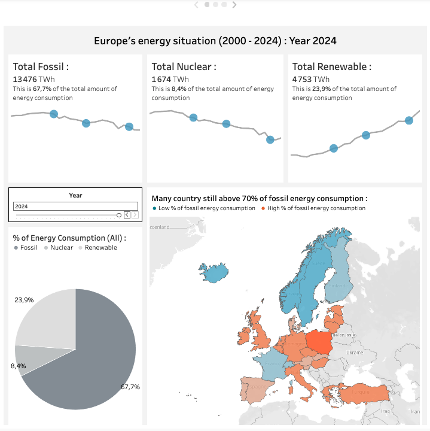
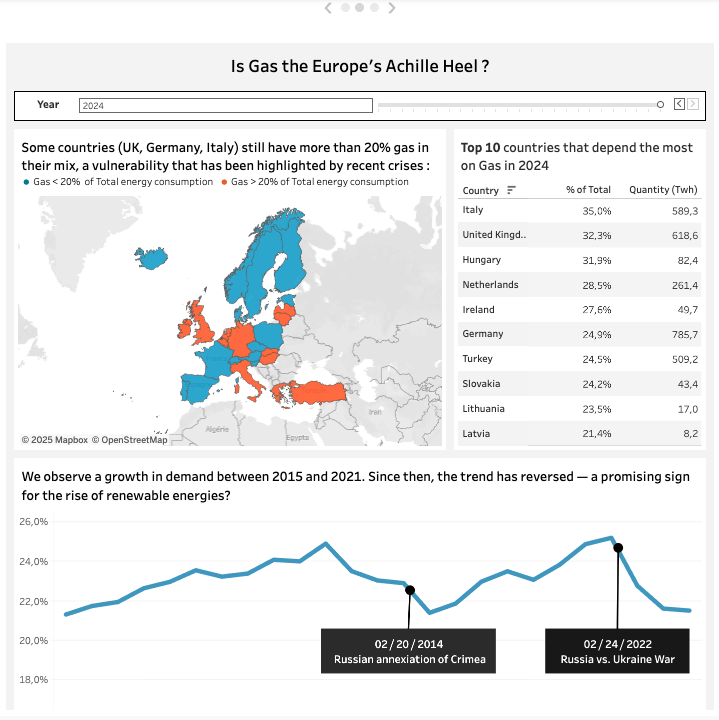
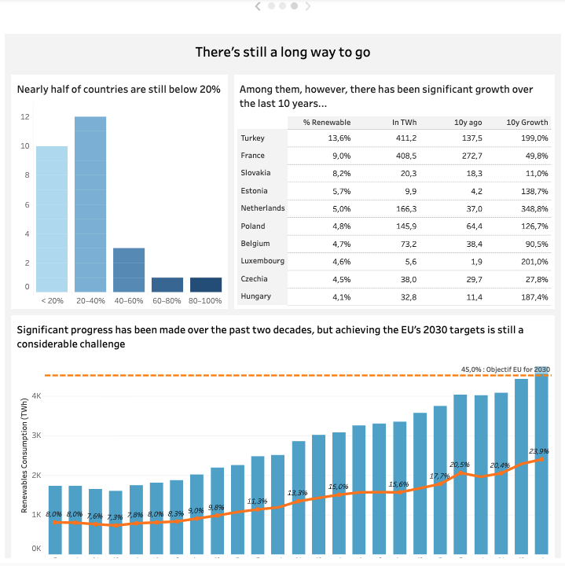

# Projet Data Analyst : Analyse de l'énergie en Europe

## 🎯 Contexte du projet

Ce projet explore la consommation et le mix énergétique des pays européens depuis 2000, en mettant l’accent sur la **transition énergétique**, la **dépendance au gaz** et la capacité des pays à **diversifier leurs sources d’énergie**.  
L’objectif : transformer un dataset riche en **insights actionnables** à travers une **analyse data-driven** et des dashboards interactifs Tableau.

Le projet est construit pour démontrer :
- Capacité à poser **une question business / stratégique claire**
- Maîtrise de la **préparation et transformation des données** (Python, SQL, Excel)
- Capacité à **raconter une histoire avec les données** via dashboards et visualisations

---

## 🧰 Stack utilisée

- **Python (pandas)** : nettoyage, transformation, agrégation des données  
- **SQLite** : stockage et filtrage via SQL  
- **Tableau** : dashboards interactifs et storytelling  
- **Excel** : import/export des datasets

---

## 📂 Contenu du repo

energy-analysis-eu/
├─ data/
│ └─ sample/ # échantillon des données pour test
├─ notebooks/
│ └─ 01_data_cleaning.ipynb # préparation des données depuis Excel/SQLite
├─ sql/
│ └─ queries.sql # requêtes SQL utilisées pour filtrer/transformer
├─ scripts/
│ ├─ excel_to_sqlite.py # script original pour charger Excel dans SQLite
│ └─ sql_to_excel.py # script pour récupérer le dataset final
├─ tableau/screenshots/
│ └─ dashboard1.png # captures d’écran des dashboards Tableau
├─ README.md
└─ .gitignore


> **Remarque :** Les fichiers de données brutes (`owid-energy-data.xlsx`) ne sont pas inclus pour éviter de partager des fichiers volumineux ou sensibles. Un échantillon est disponible dans `data/sample/`.

---

## 📖 Workflow du projet

### 1️⃣ Préparation des données
- Chargement du fichier Excel original via `pandas`
- Import dans SQLite pour requêtes SQL
- Filtrage des pays européens et années pertinentes
- Transformation des colonnes et calcul d’indicateurs clés
- Export du dataset final pour Tableau (`energie_transfo_01.xlsx`)

### 2️⃣ Analyse & storytelling

Le projet est structuré autour de **3 dashboards Tableau** :

#### Dashboard 1 : État des lieux énergétique de l’Europe
- Objectif : poser le contexte historique
- Carte : % fossile par pays / année
- Indicateurs globaux (KPI) : part des energies fossiles, nucléaire, renouvelables
- Question clé : *“L’Europe est-elle sortie de sa dépendance aux fossiles ?”*



#### Dashboard 2 : Le gaz, talon d’Achille de l’Europe
- Objectif : montrer la dépendance au gaz
- Carte binaire ou heatmap des pays >20% gaz dans le mix
- Top 10 pays dépendants
- Timeline avec annotations géopolitiques (2014, 2022)
- Question clé : *“Quels pays européens sont les plus exposés au risque de rupture d’approvisionnement en gaz ?”*



#### Dashboard 3 : Les alternatives énergétiques
- Objectif : montrer la transition et le chemin qu'il reste à parcourir
- Répartition des pays par % d'énergie renouvelable utilisé sur le total
- Top 10 des pays les plus en retard, montrant aussi leur progression
- Question clé : *“Malgrès une tendance à la hausse, est-ce que les objectifs de l'UE pour 2030 sont toujours atteignables ?”*



### 3️⃣ Insights
- Contexte historique intégré directement dans les visualisations  
- Comparaisons dynamiques entre périodes (2000 vs aujourd’hui)  
- Ratios pertinents (% fossile, variation annuelle des renouvelables)  
- Mini-analyses textuelles accompagnant chaque dashboard pour **contexte et interprétation**

---

## 🚀 Reproduire le workflow

1. Installer les dépendances Python :  
```bash
pip install pandas openpyxl sqlite3

2. Préparer les données :
python scripts/excel_to_sqlite.py   # charger le fichier Excel dans SQLite
python scripts/sql_to_excel.py      # récupérer le dataset filtré

3. Explorer le notebook : notebooks/01_data_cleaning.ipynb
    Toutes les étapes de transformation et filtrage sont expliquées
    Le dataset final pour Tableau est produit

Visualiser les dashboards Tableau :
    Les captures sont dans tableau_screenshots/
    Pour un partage interactif, lien vers Tableau Public : [https://public.tableau.com/views/Project_Energy_EU_Story/Story1?:language=fr-FR&:sid=&:redirect=auth&:display_count=n&:origin=viz_share_link] 

